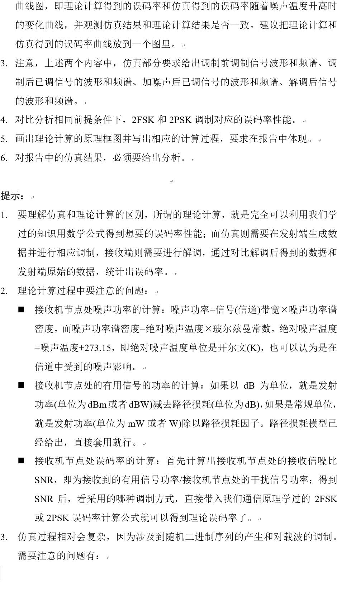
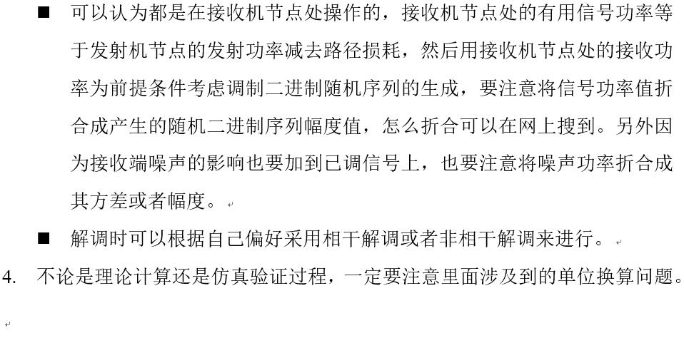

# Curriculum Design: Communication System Simulation in 2020/06

## @Notice
This Project is Done in Python

## @Requirements

- Basic algebra packages
    - numpy
    - matplotlib
    - scipy
    - random
    
- Packages completed by my own
    - CSModel
    
## @Environment
- OS: Windows_10_2004
- Software: Pycharm
- Package manager: Anaconda

## Author
`Leon Rein` - 170200920 - 1702403 - HIT(WH)    
1.leonrein@gmail.com

---
---
DDL: 2020/06/26

